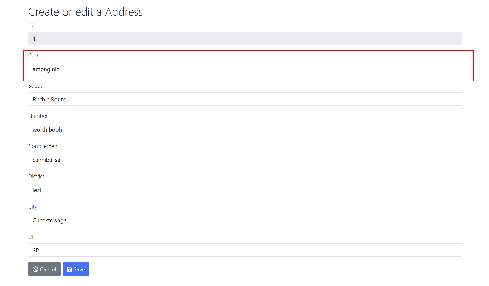

# Facilite Dev Jr — README

## Resumo da aplicação

Monólito JHipster com CRUD de Funcionários, Departamentos e Endereços. O desafio é implementar a consulta de CEP via backend que integra o ViaCEP e preenche o formulário de endereço no front.

---

## Stack e baseline

- Spring Boot + JWT, MapStruct, JPA, Gradle
- Angular + RxJS + Jest + Cypress
- PostgreSQL (dev/prod) • Docker Compose opcional
- Documentação base JHipster: [JHipster 8.11.0 archive](https://www.jhipster.tech/documentation-archive/v8.11.0)

---

## Requisitos

- Java 17
- Node 18+ (usar `./npmw`)
- PostgreSQL 14+ ou Docker
- Gradle Wrapper

---

## Setup rápido

### 1) Variáveis de ambiente

A configuração do acesso ao banco de dados é feita no arquivo application-dev.yml e está, por padrão, como abaixo:

```yaml
# Banco local
datasource:
  type: com.zaxxer.hikari.HikariDataSource
  url: jdbc:postgresql://localhost:5432/devjr
  username: postgres
  password: root
```

Você pode criar um banco com o nome "devjr" e rodar a aplicação.
Altere usuário e senha do banco de dados no arquivo application-dev.yml de acordo com a sua necessidade. Por padrão, o usuário é 'postgres' e a senha 'root'

#### Se preferir, configure as variáveis de ambiente:

```bash
# Banco local
export SPRING_DATASOURCE_URL=jdbc:postgresql://localhost:5432/hrlite
export SPRING_DATASOURCE_USERNAME=hrlite
export SPRING_DATASOURCE_PASSWORD=hrlite
```

### 2) Banco via Docker (opcional)

```bash
docker run -d --name pg-facilitedevjr \
  -e POSTGRES_DB=facilitedevjr \
  -e POSTGRES_USER=facilitedevjr \
  -e POSTGRES_PASSWORD=facilitedevjr \
  -p 5432:5432 postgres:14
```

### 3) Backend

> Executar com profile 'dev' (com o comando abaixo, ou importar a aplicação em IDE e apenas executar o projeto java)

```bash
./gradlew -x webapp
```

também é possível executar com o comando:

```bash
SPRING_PROFILES_ACTIVE=dev ./gradlew bootRun
```

- API: `http://localhost:8080`
- Swagger UI: `/swagger-ui/index.html`

### 4) Frontend

```bash
npm install
npm start
```

- UI: `http://localhost:9000`

---

## Perfis e autenticação

Após execução da aplicação, basta fazer login com usuário 'admin' e senha 'admin'.

---

## Referências JHipster

- Docs: [https://www.jhipster.tech](https://www.jhipster.tech)
- Stack padrão: Spring Boot, Spring Security, MapStruct, JPA, Angular
- Convenções: DTO + Mapper + ServiceImpl + Resource, paginação e filtros via JHipster

---

## Arquitetura (visão macro)

- `web/rest` — _Resources_ REST
- `service` — orquestração, regras, integrações
- `service/dto` — DTOs de fronteira
- `service/mapper` — MapStruct
- `domain` — entidades JPA
- `repository` — Spring Data
- `src/main/webapp/app` — Angular (módulos, components, services)

Entidades principais:

- `Department(name, costCenter)`
- `Address(cep, street, number, complement, district, city, uf)`
- `Employee(firstName, lastName, email, phone, hireDate, salary, active, department, address)`

Paginação padrão JHipster em listagens.

---

## Desafio técnico do candidato

Implementar a funcionalidade **“Buscar CEP”**

- Ao fazer login na aplicação, você tem um menu 'Entities' > 'Address'.
- A aplicação recentemente gerada vai inicializar com registros aleatórios como exemplo.
- O objetivo da task é implementar, no formulário de cadastro/edição de endereço a funcionalidade de consulta de CEP para preenchimento automático do formulário.
- Fica livre ao candidato o gatilho da consulta de CEP, sendo um botão ou a busca automática ao terminar de digitar.
- Fica livre também a instalação de pacotes e dependências, como por exemplo uma biblioteca de máscara de input.
  

> Alguns métodos e classes já foram criados, sem implementação, para orientar o desenvolvimento.

### **Dica e sugestão**:

- Criar botão para consulta do CEP (address-update.component.html).
- Ao clicar no botão, chamar método onBuscarCep() no arquivo address-update.component.ts.
- O método deve identificar e validar o valor do campo de CEP. Se estiver correto, chamar o método cepLookup(cep:string) no arquivo address.service.ts.
- O método da service deve disparar um request ao backend `GET /api/cep/{cep}` e aguardar o retorno do objeto Address
- No backend, implementar o método get() na classe CepLookupResource chamando o método lookup() da CepLookupService
- Implementar, na classe CepLookupServiceImpl, consulta de CEP na API do viacep `https://viacep.com.br/ws/{cep}/json/`
- Documentação do viacep: https://viacep.com.br/

> A seguir, informações técnicas separadas em frontend e backend.

### Back-end a implementar

- **Endpoint**: `GET /api/cep/{cep}` retorna `AddressDTO`
- **Serviço**:

  - `normalizeCep(String raw)`: remover não dígitos, validar exatamente 8 dígitos; inválido → **400**
  - `lookup(String cep)`: chamar `https://viacep.com.br/ws/{cep}/json/`

    - `erro=true` → **404**
    - Falha de rede/timeout/5xx → **502**
    - Mapear:

      - `logradouro` → `street`
      - `bairro` → `district`
      - `localidade` → `city`
      - `uf` → `uf`
      - `complemento` → `complement`

**Stubs já presentes**

- `CepLookupResource.get(String cep)`
- `CepLookupService.normalizeCep(String raw)`
- `CepLookupService.lookup(String cep)`

### Front-end a implementar

- Serviço `cep-lookup.service.ts.fetch(cep: string)` chamando `/api/cep/{cep}`
- `employee-update.component.ts.onBuscarCep()`:

  - Normalizar CEP
  - Loading + desabilitar botão
  - Preencher `street, district, city, uf, complement`
  - Preservar `number` se já digitado
  - Exibir mensagens de erro:

    - 400 “CEP inválido”
    - 404 “CEP não encontrado”
    - 502 “Serviço de CEP indisponível”

---

## Critérios de aceite

### Funcional

- `GET /api/cep/{cep}` responde **200** com `AddressDTO` completo quando CEP existe.
- Formulário de Employee é preenchido ao acionar “Buscar CEP”.
- Erros tratados e exibidos conforme status: 400, 404, 502.
- Campo `number` permanece intacto após _autofill_.

### Qualidade técnica

- Código coeso, desacoplado.
- Tratamento de exceções consistente e mapeado para HTTP correto.
- MapStruct aplicado para DTO.

### Manutenibilidade e DX

- Nomes, pacotes e responsabilidades alinhados ao padrão JHipster.

### UX mínima

- Estado de carregamento no botão.
- Mensagens de erro claras e não intrusivas.
- Não perder dados manuais já digitados.

## Troubleshooting

- `Connection refused` no banco: valide `SPRING_DATASOURCE_URL` e container Postgres.
- CORS no dev: usar proxy do JHipster ou `application-dev.yml` com CORS habilitado.
- Erros de build Angular: remover `node_modules`, `npm ci`, `npm start`.

---

## Scripts úteis

```bash
# Lint front
npm run lint

# Limpeza backend
./gradlew clean

# Executar com profile dev
SPRING_PROFILES_ACTIVE=dev ./gradlew bootRun
```

---

## Estrutura de pastas (resumo)

```
src/main/java/.../web/rest         # Resources REST
src/main/java/.../service          # Serviços e casos de uso
src/main/java/.../service/dto      # DTOs
src/main/java/.../service/mapper   # MapStruct
src/main/java/.../domain           # Entidades JPA
src/main/java/.../repository       # Repositórios
src/main/webapp/app/               # Angular app
```

Entregue a implementação e os testes. Inclua breve nota técnica no PR descrevendo decisões e trade-offs.
